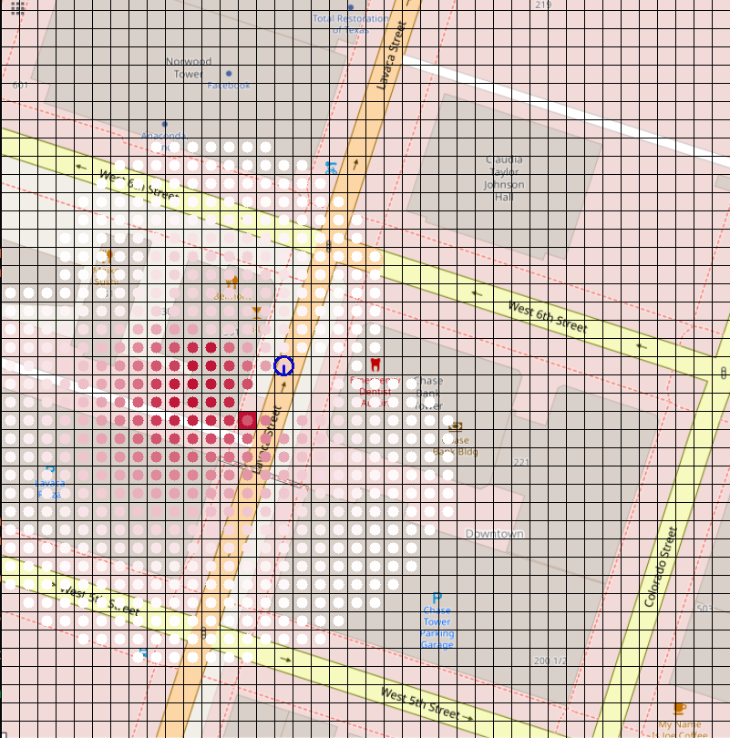

## [**Spatial Language Understanding for Object Search in Partially Observed City-scale Environments**](https://arxiv.org/abs/2012.02705)
[Kaiyu Zheng](https://kaiyuzheng.me/),
[Deniz Bayazit](https://bayazitdeniz.github.io/),
[Rebecca Mathew](https://github.com/beckymathew),
[Ellie Pavlick](http://cs.brown.edu/people/epavlick/),
[Stefanie Tellex](https://h2r.cs.brown.edu/) <br>
Department of Computer Science, Brown University<br>
30th IEEE International Conference on Robot and Human Interactive Communication (RO-MAN), 2021

**Website:** [https://h2r.github.io/sloop/](https://h2r.github.io/sloop/)

**Github repository:** [https://github.com/h2r/sloop](https://github.com/h2r/sloop)

**ArXiv:** [https://arxiv.org/abs/2012.02705](https://arxiv.org/abs/2012.02705)


## Table of Contents:

* [Installation](#installation)
* [Download Dataset & Models](#dataset-and-models)
* [Download Results & Reproduce](#results)
* [OpenStreetMap Demo](#openstreetmap-demo)
* [AirSim Demo](#airsim-demo)
* [Citation](#citation)

<!-- #<># -->


## 1. Installation <a name="installation"/>

The required python version is Python 3.6+.

1. Clone the repository and create and virtual environment with the following lines.

    ```
    git clone git@github.com:h2r/sloop.git
    cd sloop;
    virtualenv -p $(which python3) venv/sloop
    source venv/sloop/bin/activate
    ```

    For the last step, you can also do `source setup.bash` for convenience.

2. Install [pomdp-py](https://github.com/h2r/pomdp-py)

    ```
    pip install pomdp-py>=1.2.4.5
    ```

3. Install the `sloop` package. Assume you're at the root of the sloop repository.

    ```
    pip install -e .
    ```

    Note that this will install a number of dependencies, including [pomdp-py](https://h2r.github.io/pomdp-py/html/) version 1.2.4.5. See `setup.py` for the list of packages. The `>=` symbol assumes backwards compatibility of those packages.


4. Download spaCy model. For dependency parsing, we use the [`en_core_web_md` model](https://spacy.io/models/en#en_core_web_md) from spaCy.
   You can download it by:

    ```
    python -m spacy download en_core_web_md
    ```

## 2. Download Dataset & Models <a name="dataset-and-models"/>
There is one dataset and two models.

* The dataset contains OpenStreetMap data and AMT spatial language descriptions and annotations.
  Download the dataset from  [here](https://drive.google.com/file/d/1K1SRR3rHcM8Jndjhb-YTB5kqefDNYYbH/view?usp=sharing) (SL\_OSM\_Dataset, 3.6MB), and place it under `sloop/datasets` and extract there.
   After extraction your directory structure should look like:

    ```
    / # repository root
      sloop/
          ...
          datasets/
            SL_OSM_Dataset/
              amt/
              frame_of_ref/
              ...
    ```

     Check out [this wiki page](https://github.com/h2r/sloop/wiki/Dataset-Documentation) for documentation about the dataset.


* The models are the frame of reference prediction models. There is a **front** model (for _front_ and _behind_) and a **left** model (for _left_ and _right_).
Download the models from [here](https://drive.google.com/file/d/1XfOUa0xtRstUxJHBdNmk4SLJw970-4vV/view?usp=sharing) (models.zip, 42.4MB)
and place it under `sloop/oopomdp/experiments/resources`.

    After extraction your directory structure should look like:

     ```
     / # repository root
       sloop/
           ...
           oopomdp/
               experiments/
                   resources/
                       models/
                           iter2_ego-ctx-foref-angle:front:austin
                           ...
     ```


## 3. Download and Process Results <a name="results"/>

You can download the full results (including individual trial results) from [here](https://drive.google.com/file/d/1Sg3Or5tB5Gublmv2okcWA4-mjIIwS5Oo/view?usp=sharing)
(all-joint-sloop.zip, 2.0GB), and place it under `sloop/`

  After extraction your directory structure should look like:

    / # repository root
      sloop/
          results/
              all-joint-sloop/
                  langprior-austin_00_informed#5-austin-laser:fov=90:min*range=1:max*range=3:angle*increment=0.5:occlusion*enabled=False-na/
                  ...

#### To process results:
1. `cd sloop/results/all-joint-sloop`
2. `python gather_results.py`

    Expected output

     ```
     ...
     Warning: <class 'sloop.oopomdp.experiments.reward_result.RewardsResult'> result file rewards.yaml not found in /media/kz-wd-ssd/repo/sloop/results/all-joint-sloop/langprior-austin_380_rule#based#ego>ctx>foref>angle-austin-laser:fov=90:min*range=1:max*range=4:angle*increment=0.5:occlusion*enabled=False-ego>ctx>foref>angle
     Collected results in langprior-austin_380_rule#based#ego>ctx>foref>angle-austin-laser:fov=90:min*range=1:max*range=4:angle*increment=0.5:occlusion*enabled=False-ego>ctx>foref>angle
     Collected results in langprior-cleveland_41_mixture#full#auto-cleveland-laser:fov=90:min*range=1:max*range=3:angle*increment=0.5:occlusion*enabled=False-ego>ctx>foref>angle
     Collected results in langprior-honolulu_19_informed#5-honolulu-laser:fov=90:min*range=1:max*range=3:angle*increment=0.5:occlusion*enabled=False-na
     Collected results in langprior-honolulu_35_keyword-honolulu-laser:fov=90:min*range=1:max*range=3:angle*increment=0.5:occlusion*enabled=False-na
     Collected results in langprior-washington,dc_33_keyword-washington,dc-laser:fov=90:min*range=1:max*range=4:angle*increment=0.5:occlusion*enabled=False-na
     Warning: <class 'sloop.oopomdp.experiments.states_result.StatesResult'> result file states.pkl not found in /media/kz-wd-ssd/repo/sloop/results/all-joint-sloop/langprior-austin_380_rule#based#ego>ctx>foref>angle-austin-laser:fov=90:min*range=1:max*range=4:angle*increment=0.5:occlusion*enabled=False-ego>ctx>foref>angle
     Collected results in langprior-cleveland_39_keyword#auto-cleveland-laser:fov=90:min*range=1:max*range=5:angle*increment=0.5:occlusion*enabled=False-na
     Collected results in langprior-denver_29_informed#5-denver-laser:fov=90:min*range=1:max*range=4:angle*increment=0.5:occlusion*enabled=False-na
     Collected results in langprio
     ...
     ```

     This will generate many plots and results in png/csv/yaml/json formats.

3. `python ../refine.py ./`

       This will generate some more tables that are better organized and readable,
    using the files generated from the last step as input.


### To reproduce the experiment

1. `cd sloop/results/all-joint-sloop`
2. Notice there are several scripts `run_{1,2,3,4}.sh`. Each contains commands to run individual trials. You can break them up further if you want more parallelization (you can automatically break them up using the `generate_run_scripts.py` and increase the value for the variable `SPLIT`.
3. Now, run the experiment by running `./run_#.sh` wher `#` is the index of the run file.
Note that because the experiment is random, the final result may differ slightly from those reported in the paper.


## 4. Running on OpenStreetMap <a name="openstreetmap-demo"/>
You can now start a demo of spatial language object search on an OpenStreetMap by running
```
cd sloop/oopomdp/experiments
python interface.py
```
This starts a terminal interface. We will walk through an example below.

At start, the program loads several things:
```
$ python interface.py
pygame 2.0.1 (SDL 2.0.14, Python 3.8.8)
Hello from the pygame community. https://www.pygame.org/contribute.html
Loading spacy model...
Loading spatial keywords...
Loading symbol to synonyms...
```
Then, it asks for a city name. You can enter any one from `austin, cleveland, denver, honolulu, washington_dc`.
We will enter `austin`.
```
map name: austin
Loading mapinfo
```
Then, it asks for number of objects (maximum 3). We will enter 1:
```
num objects, max 3 [2]: 1
```
Then, sensor range; The is the depth of the fan-shaped sensor with fixed field of view angle of 90 degrees.
Sensor range of 3 refers to a range of 15m, 4 is 20m, 5 is 25m.
```
Sensor range [4]: 3
```
You can enter the true x, y location of the target object (a red car). Leave it blank for random.
```
x, y for object R [random]:
```
Then, a window pops up. The blue circle is the robot. Its starting location is random.


Then, You are asked to enter a spatial language description of the target's location.
```
Hint: the red car is by the lavaca street behind HiLo.
```
Now you can enter the method that essentially interprets the language as a prior belief over the target location,
through one belief update step. The choices are `mixture`, `sloop`, `keyword`, `informed`, `uniform`.
They correspond to SLOOP(m=4), SLOOP, MOS(keyword), informed, uniform in our experiments.
```
Prior type [mixture]:
Loading ego_ctx_foref_angle model for right
...
```
Then the program processes the language, and then the robot starts to search. You will see
output similar to this
```
...
Language: "the red car is by the lavaca street behind HiLo."
MAP: austin
{'entities': ['RedHonda', 'HiLo', 'LavacaSt'], 'relations': [('RedHonda', 'LavacaSt', None), ('RedHonda', 'HiLo', 'behind')], 'lang': 'the RedHonda is by LavacaSt behind HiLo.'}
2021-07-07 13:49:44.438213 Event (Normal): Trial interface-mixture_mixture-austin-laser:fov=90:min*range=1:max*range=3:angle*increment=0.5:occlusion*enabled=False-ego>ctx>foref>angle | Step 1:  action: move-vw-TurnRight   reward: -11.000   cum_reward: -11.000   NumSims: 300   PlanTime: 0.61667
2021-07-07 13:49:45.094287 Event (Normal): Trial interface-mixture_mixture-austin-laser:fov=90:min*range=1:max*range=3:angle*increment=0.5:occlusion*enabled=False-ego>ctx>foref>angle | Step 2:  action: move-vw-TurnRight   reward: -11.000   cum_reward: -22.000   NumSims: 300   PlanTime: 0.61652
2021-07-07 13:49:45.781581 Event (Normal): Trial interface-mixture_mixture-austin-laser:fov=90:min*range=1:max*range=3:angle*increment=0.5:occlusion*enabled=False-ego>ctx>foref>angle | Step 3:  action: move-vw-TurnRight   reward: -11.000   cum_reward: -33.000   NumSims: 300   PlanTime: 0.64700
2021-07-07 13:49:46.453592 Event (Normal): Trial interface-mixture_mixture-austin-laser:fov=90:min*range=1:max*range=3:angle*increment=0.5:occlusion*enabled=False-ego>ctx>foref>angle | Step 4:  action: move-vw-Forward   reward: -11.000   cum_reward: -44.000   NumSims: 300   PlanTime: 0.63122
2021-07-07 13:49:47.136918 Event (Normal): Trial interface-mixture_mixture-austin-laser:fov=90:min*range=1:max*range=3:angle*increment=0.5:occlusion*enabled=False-ego>ctx>foref>angle | Step 5:  action: find   reward: 1000.000   cum_reward: 956.000   NumSims: 300   PlanTime: 0.65474
2021-07-07 13:49:47.164189 Event (Normal): Trial %s | Task Finished!
...
```
and the window now may look something like this:




## 5. Running on AirSim <a name="airsim-demo"/>

This requires installation of Unreal Engine 4 and AirSim, following AirSim's documentation. ([Linux](https://microsoft.github.io/AirSim/build_linux/), [Windows](https://microsoft.github.io/AirSim/build_windows/)),
as well as downloading assets for the UE4 environment e.g. [Neighborhoods](https://www.unrealengine.com/marketplace/en-US/product/modular-neighborhood-pack) and [Urban City](https://www.unrealengine.com/marketplace/en-US/product/urban-city).
Detailed instructions can be found in [this wiki page](https://github.com/h2r/sloop/wiki/Running-SLOOP-object-search-on-AirSIm-UE4).

The search trial is started by running `python controller.py`.

Here is an example screenshot:


## 6. Citation <a name="citation"/>

```
@inproceedings{sloop-roman-2020,
  title={Spatial Language Understanding for Object Search in Partially Observed Cityscale Environments},
  author={Zheng, Kaiyu and Bayazit, Deniz and Mathew, Rebecca and Pavlick, Ellie and Tellex, Stefanie},
  booktitle={2021 IEEE International Conference on Robot and Human Interactive Communication (RO-MAN)},
  year={2021},
  organization={IEEE}
}
```
